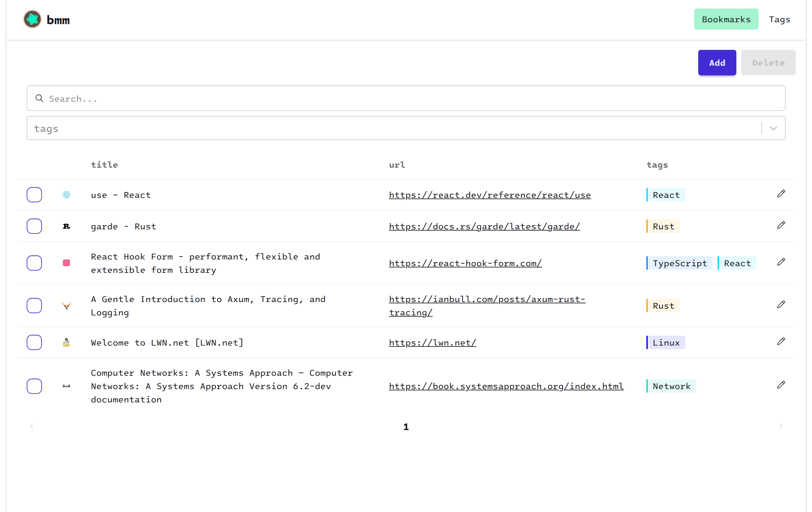

# bmm

A bookmark manager

no need to organize bookmarks on directory-like; just tag.

## Tech Stack

sometimes i wasn't sure which folder to put the bookmark in.
i've been wanted to try implementing a web app in rust, so i thought it's a good opportunity to challenge it :)

- backend
  - rust
    - axum
    - sqlx
- frontend
  - typescript
    - react
    - vite
